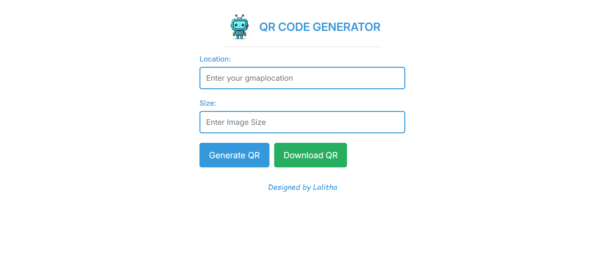

# 📍 QR Code Generator

A simple and user-friendly web application to generate and download QR codes from any Google Maps location or custom text. Built using **React**, styled with **CSS**, and deployed on **Netlify**.

🔗 **Live Website**: [location-qrcode-generator.netlify.app](https://location-qrcode-generator.netlify.app/)

---

## 🚀 Features

- ✅ Generate QR codes for Google Maps locations or any text
- 📐 Choose your own QR image size
- ⬇️ Download the generated QR code as a PNG
- 🔔 Alert notifications for actions (success, error, etc.)
- ⚡ Instant generation using [QRServer API](https://goqr.me/api/)

---

## 🎥 Preview

 <!-- You can update with a real screenshot image -->

---

## 🧑‍💻 Getting Started

Follow these steps to run the project locally:

### 1. Clone the repository

```bash
git clone https://github.com/Lalitha-SR/qr-code-generator.git
cd qr-code-generator
